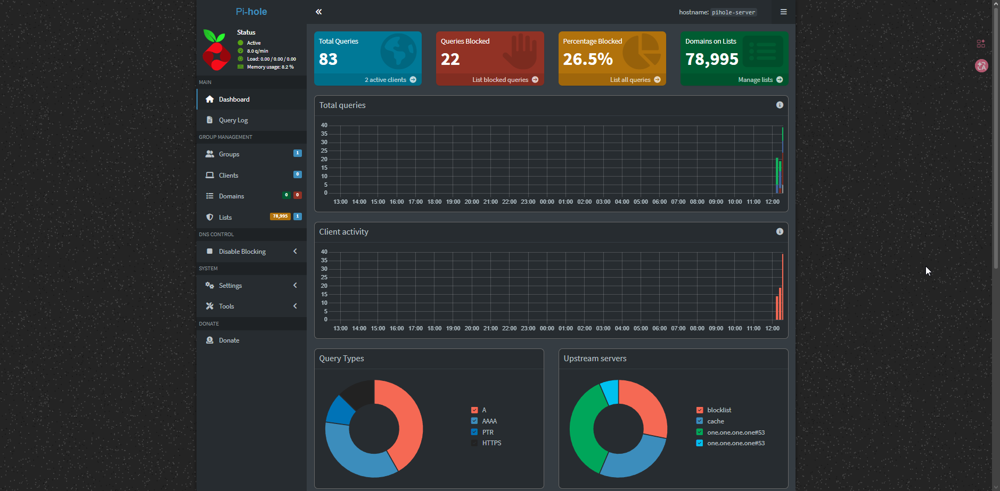
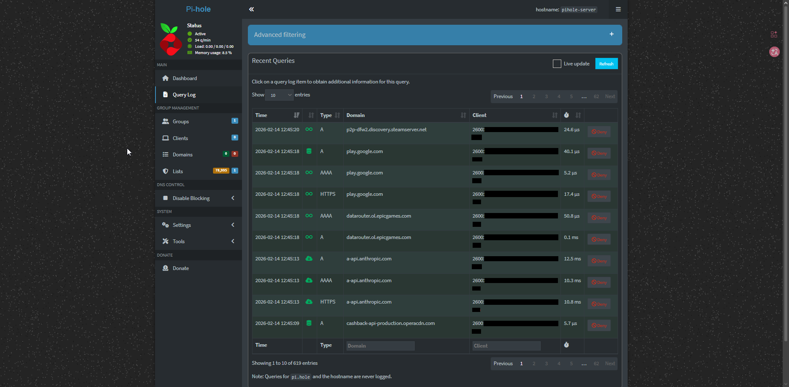

# Pi-hole Network Ad Blocker

## Overview
This project sets up a network-wide ad blocker using Pi-hole running on a Ubuntu Server VM. Pi-hole acts as a DNS server that blocks requests to known advertising and tracking domains at the network level, providing ad-free browsing across all devices.

## What I Built

- **Ubuntu Server VM** running Pi-hole DNS server
- **Network-wide ad blocking** filtering DNS requests before ads can load
- **IPv4 and IPv6 DNS configuration** to handle both protocol types
- **Web-based admin dashboard** for monitoring and management

## Tools & Technologies

- VirtualBox (VM platform)
- Ubuntu Server 24.04 LTS
- Pi-hole (DNS-based ad blocker)
- Bridged networking for LAN accessibility

## Setup Process

### 1. VM Configuration
- Created Ubuntu Server VM with 2GB RAM and 20GB disk
- Configured network adapter in bridged mode for LAN access
- Assigned static IP: `192.168.1.252`

### 2. Pi-hole Installation
Installed Pi-hole using the automated installer:
```bash
curl -sSL https://install.pi-hole.net | bash
```

Configured with:
- Upstream DNS: Cloudflare (1.1.1.1)
- Admin web interface enabled
- Query logging enabled for monitoring

### 3. Client DNS Configuration

**IPv4 DNS:**
- Primary: `192.168.1.252` (Pi-hole)
- Secondary: `1.1.1.1` (Cloudflare backup)

**IPv6 DNS:**
- Primary: `2600:xxxx:xxxx:xxxx:xxxx:xxxx:xxxx:xxxx` (Pi-hole IPv6)
- Secondary: `2606:4700:4700::1111` (Cloudflare IPv6)

### 4. Testing & Verification
- Verified DNS queries route through Pi-hole using `nslookup`
- Confirmed ad blocking by visiting ad-heavy websites
- Monitored query logs to see blocked requests in real-time

## Results


*Dashboard showing active ad blocking statistics*


*Query log displaying blocked advertising domains*

**Blocking Performance:**
- Successfully blocking **28% of DNS queries** as ads/trackers
- Noticeably cleaner browsing experience on news and media sites
- Real-time monitoring via web dashboard at `http://192.168.1.252/admin`

## Key Learnings

1. **Network Architecture**: Understanding NAT vs bridged networking and why Pi-hole needs direct LAN access
2. **DNS Hierarchy**: How DNS requests flow from client → Pi-hole → upstream resolver
3. **IPv6 Complexity**: Learned that modern networks use both IPv4 and IPv6, requiring configuration for both protocols
4. **Troubleshooting**: Diagnosed and resolved DNS timeout issues by properly configuring both IP protocol versions

## Future Enhancements

- Add WireGuard VPN for secure remote access with ad-blocking when away from home
- Configure router-wide DNS settings (currently configured per-device due to ISP router limitations)
- Implement custom blocklists for additional filtering
- Set up DHCP on Pi-hole for automatic DNS assignment to new devices

## Technical Notes

**Why IPv6 mattered:** Initially configured only IPv4 DNS, but Windows was still using IPv6 for DNS queries, bypassing Pi-hole. Had to configure Pi-hole's IPv6 address as the IPv6 DNS server to ensure all traffic routes through the ad blocker.

**Router limitations:** AT&T gateway doesn't allow DNS configuration changes. Workaround was configuring DNS settings manually on each device. Plan to replace with personal router (ASUS AXE5400) for network-wide automatic configuration.

## Skills Demonstrated

- Linux server administration
- DNS configuration and troubleshooting
- Virtual machine networking
- Network security and privacy tools
- Documentation and technical writing
